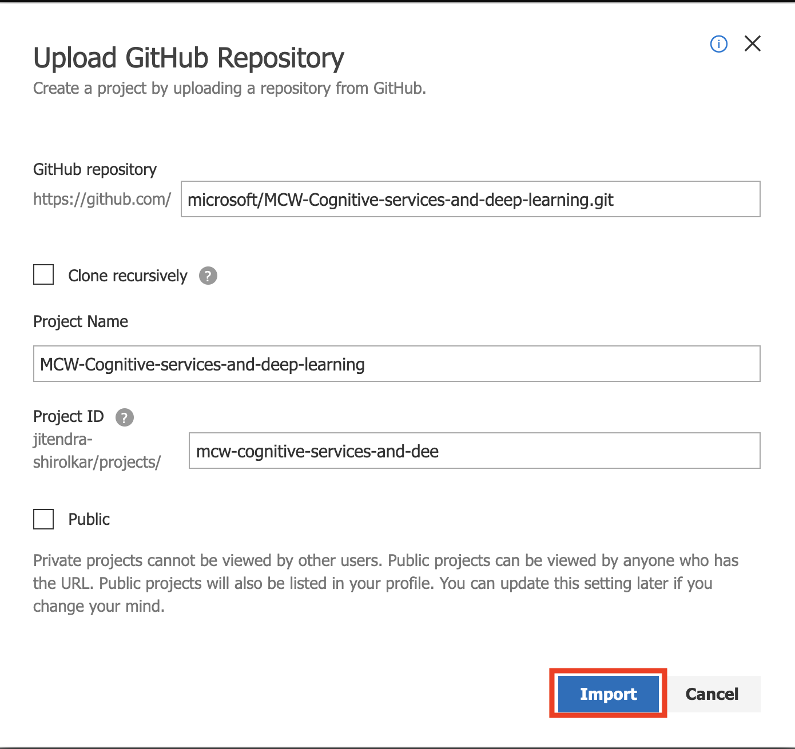
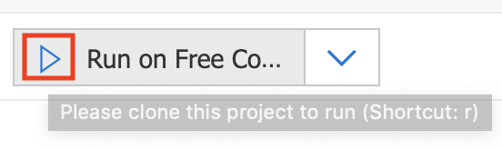
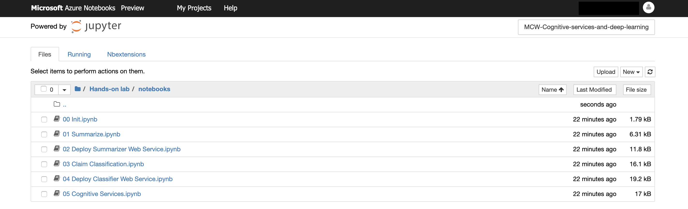

Cognitive services and deep learning

Hands-on lab step-by-step

June 2019

Information in this document, including URL and other Internet Web site references, is subject to change without notice. Unless otherwise noted, the example companies, organizations, products, domain names, e-mail addresses, logos, people, places, and events depicted herein are fictitious, and no association with any real company, organization, product, domain name, e-mail address, logo, person, place or event is intended or should be inferred. Complying with all applicable copyright laws is the responsibility of the user. Without limiting the rights under copyright, no part of this document may be reproduced, stored in or introduced into a retrieval system, or transmitted in any form or by any means (electronic, mechanical, photocopying, recording, or otherwise), or for any purpose, without the express written permission of Microsoft Corporation.

Microsoft may have patents, patent applications, trademarks, copyrights, or other intellectual property rights covering subject matter in this document. Except as expressly provided in any written license agreement from Microsoft, the furnishing of this document does not give you any license to these patents, trademarks, copyrights, or other intellectual property.

The names of manufacturers, products, or URLs are provided for informational purposes only, and Microsoft makes no representations and warranties, either expressed, implied, or statutory, regarding these manufacturers or the use of the products with any Microsoft technologies. The inclusion of a manufacturer or product does not imply endorsement of Microsoft of the manufacturer or product. Links may be provided to third-party sites. Such sites are not under the control of Microsoft and Microsoft is not responsible for the contents of any linked site or any link contained in a linked site, or any changes or updates to such sites. Microsoft is not responsible for webcasting or any other form of transmission received from any linked site. Microsoft is providing these links to you only as a convenience, and the inclusion of any link does not imply endorsement of Microsoft of the site or the products contained therein.

© 2019 Microsoft Corporation. All rights reserved.

Microsoft and the trademarks listed at <https://www.microsoft.com/en-us/legal/intellectualproperty/Trademarks/Usage/General.aspx> are trademarks of the Microsoft group of companies. All other trademarks are the property of their respective owners.

# Cognitive services and deep learning hands-on lab step-by-step

## Contents

- [Cognitive services and deep learning hands-on lab step-by-step](#cognitive-services-and-deep-learning-hands-on-lab-step-by-step)
  - [Contents](#contents)
  - [Abstract and learning objectives](#abstract-and-learning-objectives)
  - [Overview](#overview)
  - [Solution architecture](#solution-architecture)
  - [Requirements](#requirements)
  - [Exercise 1: Setup Azure Notebooks Project](#exercise-1-setup-azure-notebooks-project)
    - [Task 1: Upload project files](#task-1-provision-azure-databricks-service)
    - [Task 2: Start the Notebook Server](#task-2-start-the-notebook-server)
  - [Exercise 2: Create and Deploy an Unsupervised Model](#exercise-2-create-and-deploy-an-unsupervised-model)
    - [Task 1: Install libraries](#task-1-install-libraries)
    - [Task 2: Read through and execute the Summarization notebook](#task-2-read-through-and-execute-the-summarization-notebook)
    - [Task 3: Provision the Azure Machine Learning Workspace and Create the Summarization service](#task-3-provision-the-azure-machine-learning-workspace-and-create-the-summarization-service)
  - [Exercise 3: Create and Deploy a Keras Model](#exercise-3-create-and-deploy-a-keras-model)
    - [Task 1: Create a simple Keras based model](#task-1-create-a-simple-keras-based-model)
    - [Task 2: Deploy the Keras model](#task-2-deploy-the-keras-model)
  - [Exercise 4: Completing the solution](#exercise-4-completing-the-solution)
    - [Task 1: Deploy the Computer Vision API](#task-1-deploy-the-computer-vision-api)
    - [Task 2: Deploy the Text Analytics API](#task-2-deploy-the-text-analytics-api)
    - [Task 3: Completing the solution](#task-3-completing-the-solution)
  - [After the hands-on lab](#after-the-hands-on-lab)
    - [Task 1: Clean up lab resources](#task-1-clean-up-lab-resources)

## Abstract and learning objectives

In this hands-on lab, you will implement a solution which combines both pre-built artificial intelligence (AI) in the form of various Cognitive Services, with custom AI in the form of services built and deployed with Azure Machine Learning service. You will learn to create intelligent solutions atop unstructured text data by designing and implementing a text analytics pipeline. You will discover how to build a binary classifier using a simple neural network that can be used to classify the textual data, as well as how to deploy multiple kinds of predictive services using Azure Machine Learning and learn to integrate with the Computer Vision API and the Text Analytics API from Cognitive Services.

At the end of this hands-on lab, you will be better able to implement solutions leveraging Azure Machine Learning service and Cognitive Services.

## Overview

In this workshop, you will help Contoso Ltd. build a proof of concept that shows how they can build a solution that amplifies the claims processing capabilities of their agents.

## Solution architecture

The high-level architecture of the solution is illustrated in the diagram. The lab is performed within the context of a notebook running within Azure Notebooks. Various notebooks are built to test the integration with the Cognitive Services listed, to train custom ML services, and to integrate the results in a simple user interface that shows the result of processing the claim with all of the AI services involved.

## Requirements

1.  Microsoft Azure subscription must be pay-as-you-go or MSDN

    a. Trial subscriptions will not work. You will run into issues with Azure resource quota limits.

    b. Subscriptions with access limited to a single resource group will not work. You will need the ability to deploy multiple resource groups.

## Exercise 1: Setup Azure Notebooks Project

Duration: 20 minutes

In this exercise, you will setup your Azure Notebooks Project.

### Task 1: Upload project files

1.  Log in to [Azure Notebooks](https://notebooks.azure.com/).

2.  Navigate to **My Projects** page.

3.  Select **Upload GitHub Repo**.

4. In the Upload GitHub Repository dialog, for the GitHub repository provide `https://github.com/microsoft/MCW-Cognitive-services-and-deep-learning.git`, and select **Import**. Allow the import a few moments to complete, the dialog will dismiss once the import has completed.

	

### Task 2: Start the Notebook Server

1. Navigate to your project: `MCW-Cognitive-services-and-deep-learning`

2. Start your Notebook server on `Free Compute` by clicking on the **Play** icon in the toolbar as shown:

	

3.  Navigate to the `> MCW-Cognitive-services-and-deep-learning > Hands-on lab > notebooks` folder where you will find all your labfiles

	

## Exercise 2: Create and Deploy an Unsupervised Model

Duration: 60 minutes

In this exercise, you will create and deploy a web service that uses a pre-trained model to summarize long paragraphs of text.

### Task 1: Install libraries

The notebooks you will run depends on certain Python libraries like `azureml-sdk`, `onnxruntime` and `nltk` that will need to be installed. The following steps walk you through adding these dependencies.

1.  Within the `notebooks` folder, click the notebook called `00 init`. This will open the notebook so you can read and execute the code it contains.

2.  Run each cell in the notebook to install the required libraries.

### Task 2: Read through and execute the Summarization notebook

1. Within the `notebooks` folder, click the notebook called `01 Summarize`. This will open the notebook so you can read and execute the code it contains.

2. Read the instructions at the top of the notebook, and execute the cells as instructed.

### Task 3: Provision the Azure Machine Learning Workspace and Create the Summarization service

1. Within the `notebooks` folder, click the notebook called `02 Deploy Summarizer Web Service`. This will open the notebook so you can read and execute the code it contains.

2. Read the instructions at the top of the notebook, and execute the cells as instructed.

## Exercise 3: Create and Deploy a Keras Model

Duration: 60 minutes

In this exercise, you will use Keras to construct and train a simple deep neural network classification model that will classify claim text as belonging to a home insurance claim or an automobile claim. You will then deploy this trained model as a web service.

### Task 1: Create a simple Keras based model

1. Within the `notebooks` folder, click the notebook called `03 Claim Classification`. This will open the notebook so you can read and execute the code it contains.

2. Read the instructions at the top of the notebook, and execute the cells as instructed.

   > Pay attention to the top of the notebook and check the version of  `tensorflow` and `keras` libraries. Tensorflow version should be >= 1.12.2 and Keras version should be >= 2.2.4.

### Task 2: Deploy the Keras model

1. Within the `notebooks` folder, click the notebook called `04 Deploy Classifier Web Service`. This will open the notebook so you can read and execute the code it contains.

2. Read the instructions at the top of the notebook, and execute the cells as instructed.

## Exercise 4: Completing the solution

Duration: 45 minutes

In this exercise, you will perform the final integration with the Computer Vision API and the Text Analytics API along with the Azure Machine Learning service you previously deployed, to deliver the completed proof of concept solution.

### Task 1: Deploy the Computer Vision API

1.  Navigate to the Azure Portal in your browser.

2.  Select **Create a resource**.

3.  Select **AI + Machine Learning** and then **Computer Vision**.\
    

4.  On the **Create** blade, provide the following:

    a. **Name:** Provide a unique name for this instance.

    b. **Subscription:** Select your Azure subscription.

    c. **Location**: Select a location nearest your other deployed services.

    d. **Pricing tier**: Select S1.

    e. **Resource group**: Select the existing mcwailab resource group.

    

5.  Select **Create**.

6.  When the notification appears that the deployment succeeded, select **Go to resource**.

    

7.  Select **Keys** and then copy the value of **Key 1** into notepad or something similar as you will need this value later in the lab.

    

8.  Select **Overview** and copy the value of Endpoint from the Essentials panel. Store this value in notepad or something similar as you will need this value later in the lab.

    

### Task 2: Deploy the Text Analytics API

1.  Navigate to the Azure Portal in your browser.

2.  Select **Create a resource**.

3.  Select **AI + Machine Learning** and then **Text Analytics**.

    

4.  On the **Create** blade, provide the following:

    a. **Name**: Provide a unique name for this instance.

    b. **Subscription**: Select your Azure subscription.

    c. **Location**: Select a location nearest your other deployed services.

    d. **Pricing tier**: Select S0.

    e. **Resource group**: Select the existing mcw-ai-lab resource group.

    

5.  Select **Create**.

6.  When the notification appears that the deployment succeeded, select **Go to resource**.

    

7.  Select **Keys**, and then copy the value of **Key 1** into notepad or something similar as you will need this value later in the lab.

    

8.  Select **Overview** and copy the value of Endpoint from the Essentials panel. Store this value in notepad or something similar as you will need this value later in the lab.

    

### Task 3: Completing the solution

1. Return to your Azure Notebooks Project. Within the `notebooks` folder, click the notebook called `05 Cognitive Services`. This will open the notebook so you can read and execute the code it contains.

2. Follow the steps within the notebook to complete the lab and view the result of combining Cognitive Services with your Azure Machine Learning Services.

## After the hands-on lab

Duration: 5 minutes

To avoid unexpected charges, it is recommended that you clean up all of your lab resources when you complete the lab.

### Task 1: Clean up lab resources

1.  Navigate to the Azure Portal and locate the `mcwailab` Resource Group you created for this lab.

2.  Select **Delete resource group** from the command bar.

    

3.  In the confirmation dialog that appears, enter the name of the resource group and select **Delete**.

4.  Wait for the confirmation that the Resource Group has been successfully deleted. If you don't wait, and the delete fails for some reason, you may be left with resources running that were not expected. You can monitor using the Notifications dialog, which is accessible from the Alarm icon.

    

5.  When the Notification indicates success, the cleanup is complete.

    

You should follow all steps provided _after_ attending the Hands-on lab.
